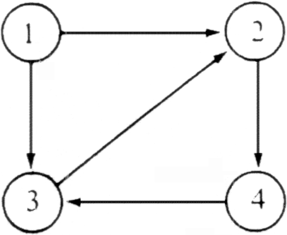

### Exercises 25.3-1
***
Use Johnson’s algorithm to find the shortest paths between all pairs of vertices in the graph of Figure 25.2. Show the values of h and w' computed by the algorithm.

### `Answer`

| v | 1 | 2 | 3 | 4 | 5 | 6 |
|---|---|---|---|---|---|---|
| h(v) | -5 | -3 | 0 | -1 | -6 | -8 |

W'(u,v) = W(u,v) + h(u) - h(v)

| (u,v) | (1,5) | (2,1) | (2,4) | (3,2) | (3,6) | (4,1) | (4,5) | (5,2) | (6,2) | (6,3) |
|---|---|---|---|---|---|---|---|---|---|---|
| w(u,v) | -1  | 1 | 2 | 2 | -8 | -4 | 3 | 7 | 5 | 10 | 
| w'(u,v) | 0 | 3 | 0 | 5 | 0 | 0 | 8 | 4 | 0 | 2 | 

### Exercises 25.3-2
***
What is the purpose of adding the new vertex s to V , yielding V' ?

### `Answer`
No matter where we start Bellmanford's algorithm, some of those vertex costs will be infinite. Johnson’s algorithm avoids this problem by adding a new vertex s to the graph, with zero-weight edges going from s to every other vertex, but no edges going back into s. This addition doesn’t change the shortest paths between any other pair of vertices, because there are no paths into s.

### Exercises 25.3-3
***
Suppose that w(u,v) >= 0 for all edges (u,v) belonging to E. What is the relationship between the weight functions w and w'?

### `Answer`
In such a case, the h(v) will be simply 0 for all the vertices v belonging to the graph because the shortest path from s to any vertex would be the direct path to that vertex from s and the weight of all those edges is 0.
Hence, w' = w.

### Exercises 25.3-4
***
Professor Greenstreet claims that there is a simpler way to reweight edges than the method used in Johnson’s algorithm. Letting w* = min{w(u,v)} over all the edges, just define w'(u,v) = w(u,v) - w* for all the edges. What is wrong with the professor’s method of reweighting?

### `Answer`
It changes shortest paths. Consider the following graph. V = {s; x; y; z} and there are 4 edges: w(s, x) = 2, w(x, y) = 2, w(s, y) = 5, and w(s, z) = -10. So we’d add 10 to every weight to make w'. With w, the shortest path from s to y is s --> x --> y, with weight 4. With w', y the shortest path from s to y is s --> y, with weight 15. (The path s --> x --> y has weight 24).
The problem is that by just adding the same amount to every edge, you penalize paths with more edges, even if their weights are low.

### Exercises 25.3-5
***
Suppose that we run Johnson’s algorithm on a directed graph G with weight function w. Show that if G contains a 0-weight cycle c, then w'(u,v) = 0 for every edge (u,v) in c.

### `Answer`
Let there be two nodes a,b in the cycle c. Assume that
	w(a,b) + h(a) - h(b) > 0
This means that
	w(b,a) + h(b) - h(a) < 0
But this is a contradiction as there are no negative edges after reweighting in the Johnson's algorithm.

### Exercises 25.3-6
***
Professor Michener claims that there is no need to create a new source vertex in line 1 of JOHNSON . He claims that instead we can just use G' = G and let s be any vertex. Give an example of a weighted, directed graph G for which incorporating the professor’s idea into JOHNSON causes incorrect answers. Then show that if G is strongly connected (every vertex is reachable from every other vertex), the results returned by JOHNSON with the professor’s modification are correct.

### `Answer`

In the example, if vertex 2, 3 or 4 is chosen as s, then the vertex 1 will be unreachable.
On adding an extra edge in the example, from vertex 4 to vertex 1, the graph becomes strongly connected and all the vertices become reachable. 
